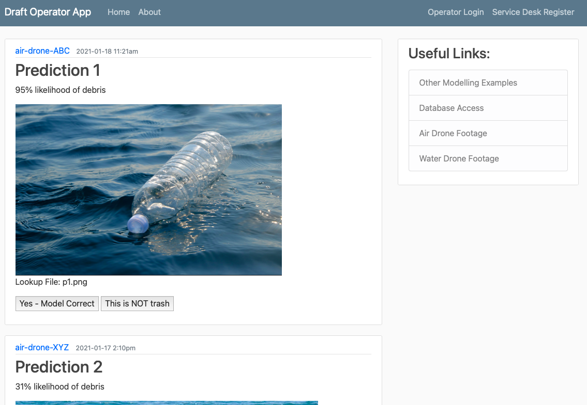

# CODE-admission

Hello!
My name is Marzena and you are likely to be assessing my entry challenge for CODE.

Below listed are the components to my project:

### WEBSITE
Please start with taking a look at [my website](https://maziiw.wixsite.com/code-takeme). This page gives a good understanding of the idea behing the project. 
I used Wix, as this seemed like the most beginner-friendly interface. Please watch the short videos and they should provide the background information regarding the project.

The website can be seen published here: ENTER WEB ADDRESS FOR WIX.

### DAG
The second component to my work is a DAG - a process graph representing, at a high-level, the flow of data in my project. 
[The design lives in lucidchart](https://lucid.app/lucidchart/invitations/accept/5a5dd57a-ba2c-4b35-b729-de1df90ae760)

#### COMPUTER VISION MODEL
    This component is the most challenging for me. I have worked with Kaggle and GitHub data to build a mockup, yes encountered several issues. I realised that this task was too ambitious for my skill level and had to abandon it dues to lack of time or necessary skill.
    I decided to keep this component as a placeholder and I hope to be lerning this during my first few semesters at CODE!

### OPERATOR VERIFICATION WEBAPP MOCKUP
One of the components has a human verification step, where a drope operator / manager / dispatcher spot-checks predictions made the model. The predicted value is the likelihood of rubbish pollution being present in the image captured. This is a webapp mockup, built using Python module - Flask, and the purpose is to show a quick idea of how I imagine this verification step.

To run the Flask webapp, here are few requirements:
    - I am using Terminal in iOS, therefore my code is adapted to iOS
    - You must have Python and Flask installed: [Flask documentation here](https://flask.palletsprojects.com/en/1.1.x/installation/)
    
    - Clone my GitHub repo: (My GitHub page - top - Clone, then follow up in terminal)
    - export FLASK_APP=flaskapp.py
    - export FLASK_DEBUG=1
    - flask.run
 Set the home directory to the [webapp] folder
    
    - cd webapp
    - python flaskapp.py
    - follow the port selected in terminal 

 The terminal will return a http port, please paste in your web browser.
    To close the app port, Ctrl+C. To open the app, you will need to rerun the python flaskapp.py command

 Your webapp should look like the following:
 
 
 
 
 ### Sources:
 Wix - create websites tutorials
 Corey Shafer - YouTube channel on building webapps
